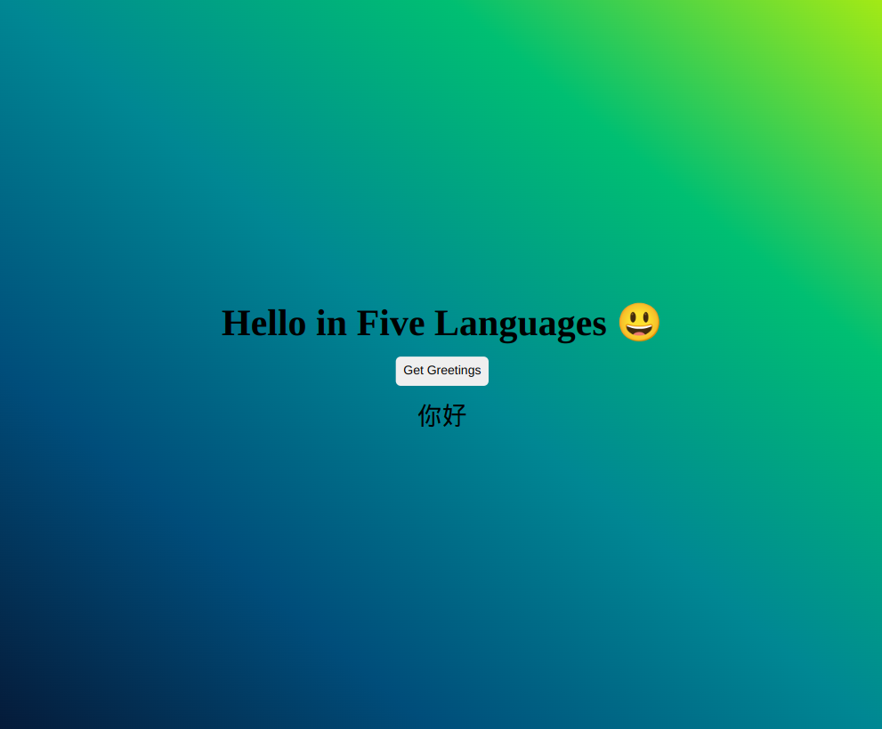

# Hello-World-RoR-React!

> Hello-rails-react is a rails and react app. This app gets data from the rails database and with the help of redux it gives react what to display using api calls. click the "Get Greetings" button and see how to say Hello in five languages!



## [Live link]()
coming soon!

## Built With

- Ruby on Rails

To get a local copy up and running follow these simple example steps.


### Setup
To get a copy of this project follow the steps below
- clone this project/download the zip file:
```
git clone https://github.com/Tobinchilongo/Hello-World-RoR-React.git
cd Hello-World-RoR-React
```
- Run 
```
rails db:seed
```
- To see the blog live on your computer run the following in two different terminals:

```
rails s

./bin/webpack -w
```

### Deployment
Coming soon


## Authors ✍️
<div align="center">

| 👤 Tobin Chilongo Jnr|
|---|
| <a target="_blank" href="https://github.com/Tobinchilongo"></a>  <a target="_blank" href="https://www.linkedin.com/in/tobin-chilongo-a6736415a/"></a> <a target="_blank" href="https://twitter.com/Tobin_Official"></a>

## 🤝 Contributing

Contributions, issues, and feature requests are welcome!

Feel free to check the [issues page](../../issues/).

## Show your support

Give a ⭐️ if you like this project!


## 📝 License

This project is [MIT](./MIT.md) licensed.


